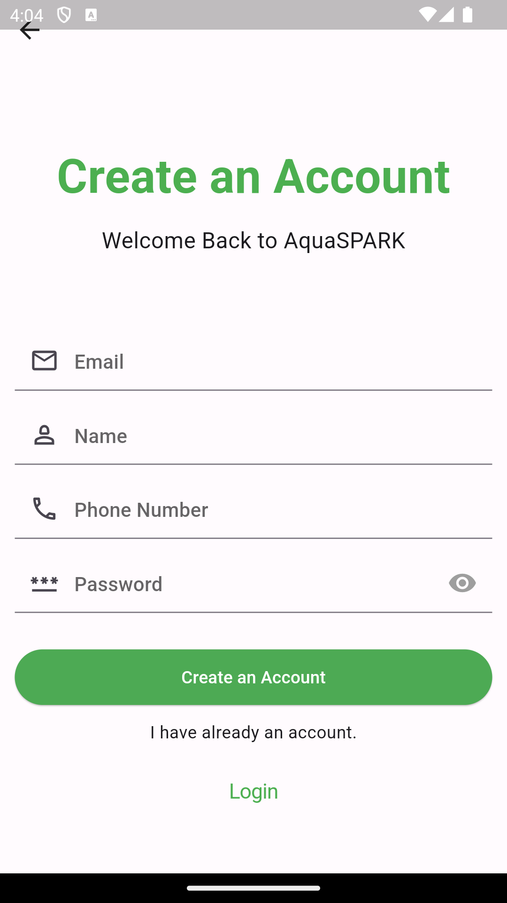
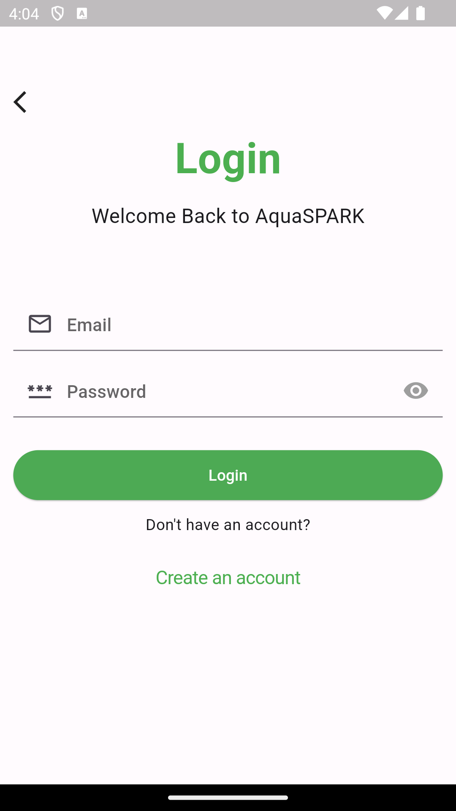
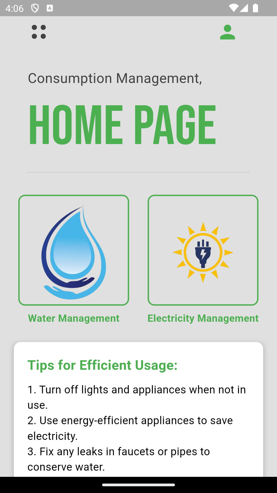
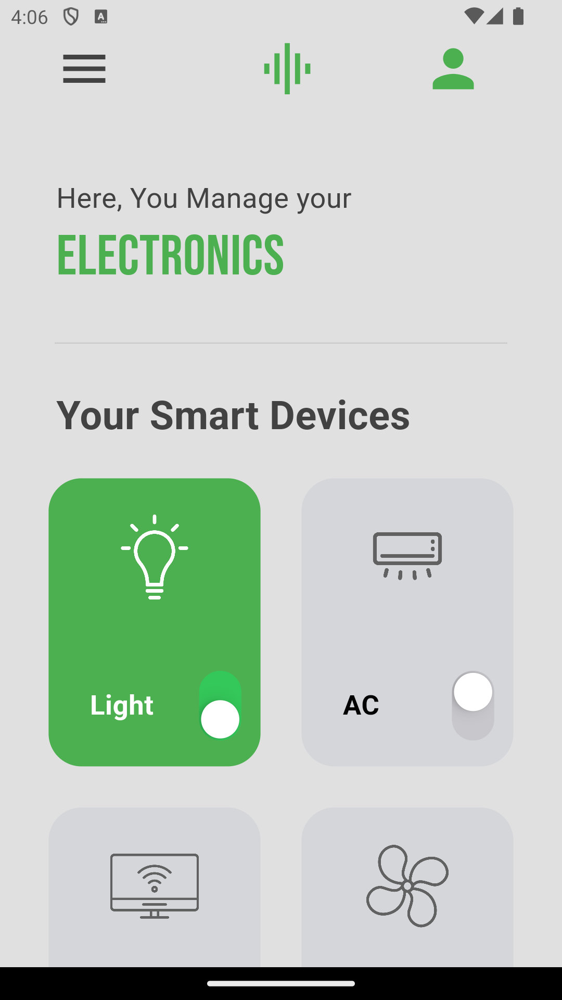
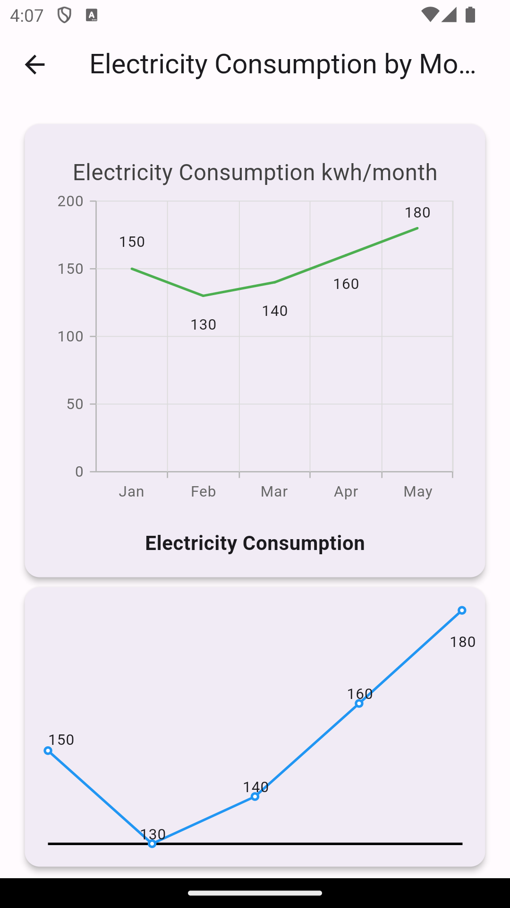
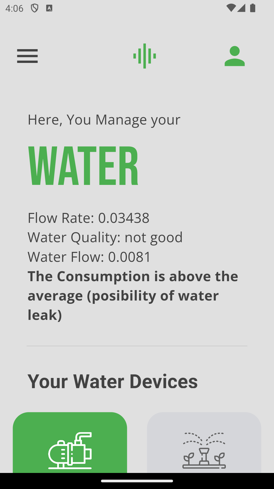
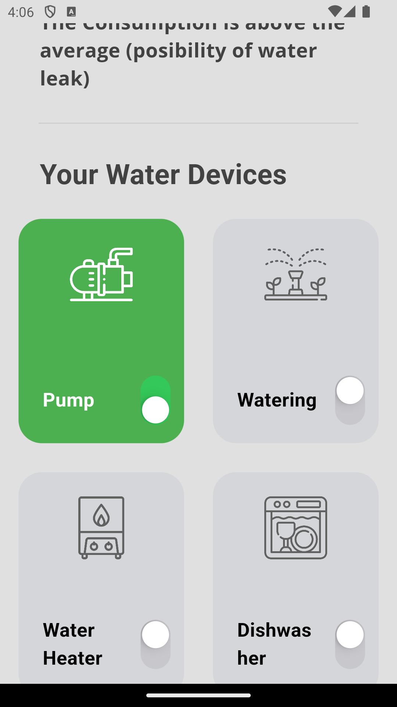
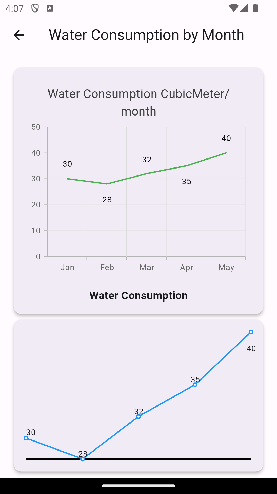

# Welcome to AQUASPARK - Smart Household Management App

Welcome to AQUASPARK, a mobile application designed to efficiently control and monitor your household consumptions. Manage the modes of all your electronic devices, schedule sleep modes, and automatically shut down devices consuming electricity during sleep mode.

For water consumption, AQUASPARK provides control over your devices and offers detailed information such as water flow, quality, and flow rate. This data is collected through sensors integrated into our smart house prototype. Additionally, the app notifies you in case of water leaks.

## Sign Up

  

To get started, sign up by providing your email, username, phone number, and password. This ensures both security and reliability, as the app utilizes the Firebase Authentication API.

1. entering the credentials
2. email verfication
3. succesfully added to our firebase database

## Log In

  

Once you've signed up, log in using your credentials.

## Home Page

  

After logging in, you'll be directed to the home page.
- **Water Management**: This feature is represented by a blue water droplet button. It allows users to monitor and manage their water usage.

- **Electricity Management**: This feature is represented by a yellow lightbulb button. It provides users with the ability to track and control their electricity consumption.

- **Efficiency Tips**: Below the management buttons, the app provides users with tips for efficient usage of resources.

## Electricity Management

  

- **Smart Devices**: Below the header, there is a large white box with a green header that reads "Your Smart Devices". Inside the box, there are four icons representing different electronic devices: a light bulb, an air conditioner, a router, and a fan. The light bulb and air conditioner icons are toggled on, while the router and fan icons are toggled off. This allows users to easily control their smart devices from the app.

This feature enhances the functionality of the app by providing users with the ability to manage their electronic devices efficiently.
- **Efficiency Tips**: Below the management buttons, the app provides users with tips for efficient usage of resources.

- ## Electricity Consumption statistics

  

 * Consumption Tracking Feature

This feature allows users to track their consumption of electricity over time. the data used for this graphs is imported from our firebase datastorage 

 Features

- Electricity Consumption kwh/Month**: This graph, with a green line, shows the user's electricity consumption in kilowatt-hours per month. The graph has a range of 0-200 and 5 data points, showing a linear increase in electricity consumption from January to May.

- Electricity Consumption**: This graph, with a blue line, shows the user's electricity consumption. The graph has a range of 0-180 and 4 data points, showing a non-linear increase in electricity consumption from January to April.

These graphs provide users with a visual representation of their consumption patterns, helping them understand their usage and make more informed decisions about their consumption habits.

## Water Management

  
  

 Water Management Feature

This feature allows users to manage their water consumption.

 Features

- **Flow Rate**: This feature displays the current flow rate of the user's water supply, this data is collected through water flow sensor and sent to our firebase database through the ESP32 board.

- **Water Quality**: This feature provides information about the quality of the user's water supply, turbidity sensor is the responsible for this data, which sent aswell through our firebase database

- **Consumption Information**: The app informs the user if their consumption is above average, helping them understand their usage patterns.

- **Water Devices**: The app displays a list of the user's water devices, allowing them to manage each device individually.

This feature enhances the functionality of the app by providing users with detailed information about their water consumption and the ability to manage their water devices.

- ## Water Consumption statistics

  

 * Consumption Tracking Feature

This feature allows users to track their consumption of electricity over time. the data used for this graphs is imported from our firebase datastorage 

 Features

- **Water Consumption by Month**: This graph shows the user's water consumption in cubic meters for the months of January through May. The graph has two lines, one green and one blue, representing different data sets of water consumption.

This graph provides users with a visual representation of their water consumption patterns, helping them understand their usage and make more informed decisions about their water consumption habits.
