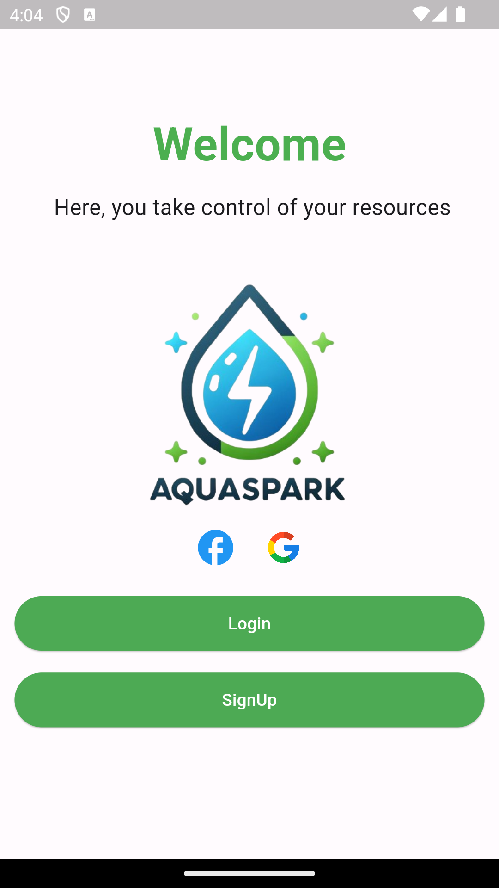

# Welcome to AQUASPARK - Smart Household Management App

Welcome to AQUASPARK, a mobile application designed to efficiently control and monitor your household consumptions. Manage the modes of all your electronic devices, schedule sleep modes, and automatically shut down devices consuming electricity during sleep mode.

For water consumption, AQUASPARK provides control over your devices and offers detailed information such as water flow, quality, and flow rate. This data is collected through sensors integrated into our smart house prototype. Additionally, the app notifies you in case of water leaks.

## Sign Up

To get started, sign up by following these simple steps:
1. Step 1
2. Step 2
3. Step 3

## Log In

Once you've signed up, log in using your credentials.

## Home Page

After logging in, you'll be directed to the home page.
